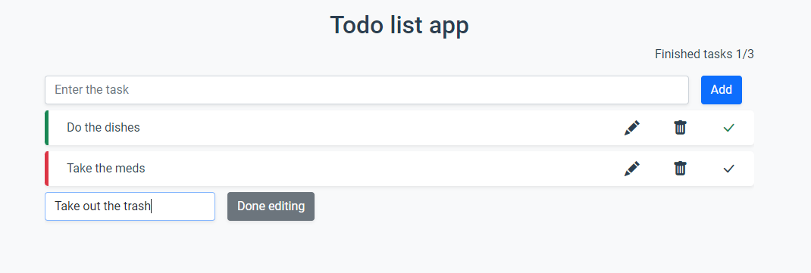

# vue-todo-list
A simple todo list app. Built using vue 3 composition api, vuex, bootstrap
demo https://vue-todo-list.onrender.com




## Project setup
```
npm install
```

### Compiles and hot-reloads for development
```
npm run serve
```

### Compiles and minifies for production
```
npm run build
```

### Lints and fixes files
```
npm run lint
```

### Customize configuration
See [Configuration Reference](https://cli.vuejs.org/config/).
